---
tags:
  - renova
  - banco-de-dados
  - modelagem
  - arquitetura
status: proposta
origem:
  - "[[Requisitos por Modulos]]"
last_update: 2026-03-16
---

# Modelagem de Banco de Dados Renova

Documento de modelagem lógica do banco para suportar os requisitos funcionais do Renova. A proposta abaixo foi pensada para um banco relacional transacional, compatível com PostgreSQL, com separação por loja, trilha de auditoria e preservação de histórico financeiro.

## Premissas de Modelagem

- As lojas são independentes entre si, mas compartilham a mesma plataforma.
- Um mesmo usuário pode atuar em mais de uma loja.
- Cliente e fornecedor pertencem ao mesmo conceito de `pessoa`.
- O crédito da loja é sempre controlado por `loja + pessoa`.
- Regras comerciais devem ser aplicadas por loja, com possibilidade de sobrescrita por fornecedor e snapshot por peça.
- Histórico financeiro e de estoque não deve ser recalculado retroativamente a partir de cadastros atuais.
- Dashboards, relatórios e portal podem ser montados sobre as tabelas transacionais, sem exigir tabelas próprias no primeiro momento.

## Convenções Sugeridas

- Chaves primárias: `uuid`.
- Timestamps: `criado_em`, `atualizado_em`.
- Auditoria de usuário quando fizer sentido: `criado_por_usuario_id`, `atualizado_por_usuario_id`.
- Exclusão lógica para entidades de cadastro: `ativo`, `inativado_em`.
- Valores monetários: `decimal(18,2)`.
- Percentuais: `decimal(5,2)`.
- Concorrência otimista: `row_version` ou equivalente do banco.

## Núcleo do Modelo

### 1. Acesso, Usuários e Permissões

#### `usuario`
Conta de acesso à plataforma.

Campos principais:
- `id`
- `nome`
- `email`
- `telefone`
- `senha_hash`
- `senha_salt` ou metadados do provedor de identidade
- `status_usuario` (`ativo`, `inativo`, `bloqueado`)
- `ultimo_login_em`
- `pessoa_id` nullable, para vincular cliente/fornecedor ao portal

Restrições:
- `email` único
- `pessoa_id` único quando preenchido

#### `usuario_sessao`
Controle de sessão, refresh token e revogação.

Campos principais:
- `id`
- `usuario_id`
- `loja_ativa_id` nullable, para manter o contexto operacional atual da sessão
- `token_hash`
- `expira_em`
- `revogado_em`
- `ip`
- `user_agent`

#### `usuario_recuperacao_acesso`
Controle de tokens de recuperação de senha.

Campos principais:
- `id`
- `usuario_id`
- `token_hash`
- `solicitado_em`
- `expira_em`
- `utilizado_em` nullable
- `ip`
- `user_agent`

#### `permissao`
Catálogo global de ações do sistema.

Campos principais:
- `id`
- `codigo`
- `nome`
- `descricao`
- `modulo`

Exemplos:
- `peca.cadastrar`
- `venda.cancelar`
- `financeiro.conciliar`
- `fechamento.conferir`

#### `cargo`
Cargo customizável por loja.

Campos principais:
- `id`
- `loja_id`
- `nome`
- `descricao`
- `ativo`

#### `cargo_permissao`
Permissões associadas ao cargo.

Campos principais:
- `id`
- `cargo_id`
- `permissao_id`

Restrições:
- único por `cargo_id + permissao_id`

#### `usuario_loja`
Vínculo de acesso do usuário à loja.

Campos principais:
- `id`
- `usuario_id`
- `loja_id`
- `status_vinculo`
- `eh_responsavel`
- `data_inicio`
- `data_fim`

Restrições:
- único por `usuario_id + loja_id`

#### `usuario_loja_cargo`
Permite um ou mais cargos por usuário dentro da loja.

Campos principais:
- `id`
- `usuario_loja_id`
- `cargo_id`

Restrições:
- único por `usuario_loja_id + cargo_id`

#### `usuario_acesso_evento`
Histórico de logins, logouts, falhas e bloqueios.

Campos principais:
- `id`
- `usuario_id`
- `tipo_evento`
- `ocorrido_em`
- `ip`
- `user_agent`
- `detalhes_json`

#### `auditoria_evento`
Registro de alterações críticas de negócio.

Campos principais:
- `id`
- `loja_id` nullable
- `usuario_id`
- `entidade`
- `entidade_id`
- `acao`
- `antes_json`
- `depois_json`
- `ocorrido_em`

### 2. Lojas e Estrutura Operacional

#### `loja`
Entidade central de segregação operacional.

Campos principais:
- `id`
- `nome_fantasia`
- `razao_social`
- `documento`
- `telefone`
- `email`
- `logradouro`
- `numero`
- `complemento`
- `bairro`
- `cidade`
- `uf`
- `cep`
- `status_loja`
- `conjunto_catalogo_id`

Restrições:
- `documento` único

#### `loja_configuracao`
Parâmetros operacionais e de impressão.

Campos principais:
- `id`
- `loja_id`
- `nome_exibicao`
- `cabecalho_impressao`
- `rodape_impressao`
- `usa_modelo_unico_etiqueta`
- `usa_modelo_unico_recibo`
- `fuso_horario`
- `moeda`

Restrições:
- único por `loja_id`

#### `conjunto_catalogo`
Agrupa lojas que reutilizam os mesmos cadastros auxiliares.

Campos principais:
- `id`
- `nome`
- `descricao`
- `ativo`

Observação:
- Resolve a necessidade de compartilhar tabelas base entre lojas autorizadas sem criar uma "rede de lojas".

### 3. Pessoas, Clientes e Fornecedores

#### `pessoa`
Cadastro mestre de pessoa física ou jurídica.

Campos principais:
- `id`
- `tipo_pessoa` (`fisica`, `juridica`)
- `nome`
- `nome_social`
- `documento`
- `telefone`
- `email`
- `logradouro`
- `numero`
- `complemento`
- `bairro`
- `cidade`
- `uf`
- `cep`
- `observacoes`
- `ativo`

Restrições:
- índice por `documento`

#### `pessoa_loja`
Relação da pessoa com a loja e dados específicos daquele vínculo.

Campos principais:
- `id`
- `pessoa_id`
- `loja_id`
- `eh_cliente`
- `eh_fornecedor`
- `aceita_credito_loja`
- `politica_padrao_fim_consignacao` (`devolver`, `doar`)
- `observacoes_internas`
- `status_relacao`

Restrições:
- único por `pessoa_id + loja_id`

#### `pessoa_conta_bancaria`
Dados bancários do fornecedor.

Campos principais:
- `id`
- `pessoa_id`
- `banco`
- `agencia`
- `conta`
- `tipo_conta`
- `pix_tipo`
- `pix_chave`
- `favorecido_nome`
- `favorecido_documento`
- `principal`

### 4. Cadastros Auxiliares

Todos os cadastros auxiliares abaixo pertencem a um `conjunto_catalogo`.

#### `produto_nome`
- `id`
- `conjunto_catalogo_id`
- `nome`
- `descricao`
- `ativo`

#### `marca`
- `id`
- `conjunto_catalogo_id`
- `nome`
- `ativo`

#### `tamanho`
- `id`
- `conjunto_catalogo_id`
- `nome`
- `ordem_exibicao`
- `ativo`

#### `cor`
- `id`
- `conjunto_catalogo_id`
- `nome`
- `hexadecimal` nullable
- `ativo`

#### `categoria`
- `id`
- `conjunto_catalogo_id`
- `nome`
- `descricao`
- `ativo`

#### `colecao`
- `id`
- `conjunto_catalogo_id`
- `nome`
- `ano_referencia`
- `ativo`

### 5. Configurações Comerciais

#### `loja_regra_comercial`
Regra padrão da loja.

Campos principais:
- `id`
- `loja_id`
- `percentual_repasse_dinheiro`
- `percentual_repasse_credito`
- `permite_pagamento_misto`
- `tempo_maximo_exposicao_dias`
- `politica_desconto_json`
- `ativo`

Restrições:
- único por `loja_id`

Observação:
- `politica_desconto_json` pode guardar faixas como "a partir de 60 dias, desconto de 10%".

#### `fornecedor_regra_comercial`
Sobrescrita da regra da loja para um fornecedor em uma loja específica.

Campos principais:
- `id`
- `pessoa_loja_id`
- `percentual_repasse_dinheiro`
- `percentual_repasse_credito`
- `permite_pagamento_misto`
- `tempo_maximo_exposicao_dias`
- `politica_desconto_json`
- `ativo`

Restrições:
- único por `pessoa_loja_id`

#### `meio_pagamento`
Meios de pagamento configurados pela loja.

Campos principais:
- `id`
- `loja_id`
- `nome`
- `tipo_meio_pagamento` (`dinheiro`, `pix`, `cartao_credito`, `cartao_debito`, `outro`)
- `taxa_percentual`
- `prazo_recebimento_dias`
- `ativo`

### 6. Peças e Estoque

#### `peca`
Entidade principal de produto estocado.

Campos principais:
- `id`
- `loja_id`
- `fornecedor_pessoa_id` nullable
- `tipo_peca` (`consignada`, `fixa`, `lote`)
- `codigo_interno`
- `codigo_barras`
- `produto_nome_id`
- `marca_id`
- `tamanho_id`
- `cor_id`
- `categoria_id`
- `colecao_id` nullable
- `descricao`
- `observacoes`
- `data_entrada`
- `quantidade_inicial`
- `quantidade_atual`
- `preco_venda_atual`
- `custo_unitario` nullable
- `status_peca` (`disponivel`, `reservada`, `vendida`, `devolvida`, `doada`, `perdida`, `descartada`, `inativa`)
- `localizacao_fisica`
- `responsavel_cadastro_usuario_id`

Restrições:
- `codigo_interno` único por loja
- `codigo_barras` índice

Observação:
- Para peça unitária, `quantidade_inicial = 1`.
- Para item em lote, o saldo é controlado por `quantidade_atual` mais histórico em `movimentacao_estoque`.

#### `peca_condicao_comercial`
Snapshot da condição comercial efetiva aplicada à peça no momento da entrada.

Campos principais:
- `id`
- `peca_id`
- `origem_regra` (`loja`, `fornecedor`, `manual`)
- `percentual_repasse_dinheiro`
- `percentual_repasse_credito`
- `permite_pagamento_misto`
- `tempo_maximo_exposicao_dias`
- `politica_desconto_json`
- `data_inicio_consignacao` nullable
- `data_fim_consignacao` nullable
- `destino_padrao_fim_consignacao` nullable

Restrições:
- único por `peca_id`

#### `peca_imagem`
Fotos da peça.

Campos principais:
- `id`
- `peca_id`
- `url_arquivo`
- `ordem`
- `tipo_visibilidade` (`interna`, `externa`)

#### `peca_historico_preco`
Histórico de alterações de preço.

Campos principais:
- `id`
- `peca_id`
- `preco_anterior`
- `preco_novo`
- `motivo`
- `alterado_em`
- `alterado_por_usuario_id`

#### `movimentacao_estoque`
Livro razão de estoque.

Campos principais:
- `id`
- `loja_id`
- `peca_id`
- `tipo_movimentacao` (`entrada`, `venda`, `devolucao`, `doacao`, `perda`, `descarte`, `ajuste`, `cancelamento_venda`)
- `quantidade`
- `saldo_anterior`
- `saldo_posterior`
- `origem_tipo` (`peca`, `venda`, `fechamento`, `ajuste_manual`)
- `origem_id`
- `motivo`
- `movimentado_em`
- `movimentado_por_usuario_id`

### 7. Vendas

#### `venda`
Cabeçalho da venda.

Campos principais:
- `id`
- `loja_id`
- `numero_venda`
- `status_venda` (`aberta`, `concluida`, `cancelada`)
- `data_hora_venda`
- `vendedor_usuario_id`
- `comprador_pessoa_id` nullable
- `subtotal`
- `desconto_total`
- `taxa_total`
- `total_liquido`
- `observacoes`
- `cancelada_em` nullable
- `cancelada_por_usuario_id` nullable
- `motivo_cancelamento` nullable

Restrições:
- `numero_venda` único por loja

#### `venda_item`
Itens vendidos com snapshot financeiro.

Campos principais:
- `id`
- `venda_id`
- `peca_id`
- `quantidade`
- `preco_tabela_unitario`
- `desconto_unitario`
- `preco_final_unitario`
- `tipo_peca_snapshot`
- `fornecedor_pessoa_id_snapshot` nullable
- `percentual_repasse_dinheiro_snapshot` nullable
- `percentual_repasse_credito_snapshot` nullable
- `valor_repasse_previsto`

Restrições:
- índice por `peca_id`

Observação:
- O snapshot evita distorção caso a regra comercial seja alterada depois.

#### `venda_pagamento`
Composição da venda por meio de pagamento.

Campos principais:
- `id`
- `venda_id`
- `sequencia`
- `meio_pagamento_id` nullable
- `tipo_pagamento` (`financeiro`, `credito_loja`)
- `conta_credito_loja_id` nullable
- `valor`
- `taxa_percentual_aplicada`
- `valor_liquido`
- `recebido_em`

### 8. Crédito da Loja

#### `conta_credito_loja`
Conta corrente de crédito por pessoa em cada loja.

Campos principais:
- `id`
- `loja_id`
- `pessoa_id`
- `saldo_atual`
- `saldo_comprometido`
- `status_conta`

Restrições:
- único por `loja_id + pessoa_id`

#### `movimentacao_credito_loja`
Livro razão de crédito.

Campos principais:
- `id`
- `conta_credito_loja_id`
- `tipo_movimentacao` (`credito_manual`, `credito_por_repasse`, `debito_por_compra`, `estorno`, `ajuste`)
- `origem_tipo` (`venda`, `obrigacao_fornecedor`, `ajuste_manual`)
- `origem_id`
- `valor`
- `saldo_anterior`
- `saldo_posterior`
- `observacoes`
- `movimentado_em`
- `movimentado_por_usuario_id`

### 9. Pagamentos e Repasses

#### `obrigacao_fornecedor`
Valor devido ao fornecedor, normalmente gerado a partir da venda de peça consignada ou da entrada de peças fixas/lote.

Campos principais:
- `id`
- `loja_id`
- `pessoa_id`
- `venda_item_id` nullable
- `peca_id` nullable
- `tipo_obrigacao` (`repasse_consignacao`, `compra_fixa`, `compra_lote`, `ajuste`)
- `data_geracao`
- `data_vencimento` nullable
- `valor_original`
- `valor_em_aberto`
- `status_obrigacao` (`pendente`, `parcial`, `paga`, `cancelada`, `ajustada`)
- `observacoes`

#### `liquidacao_obrigacao_fornecedor`
Pagamentos realizados sobre a obrigação do fornecedor.

Campos principais:
- `id`
- `obrigacao_fornecedor_id`
- `tipo_liquidacao` (`dinheiro`, `credito_loja`, `misto`)
- `meio_pagamento_id` nullable
- `conta_credito_loja_id` nullable
- `valor`
- `comprovante_url` nullable
- `liquidado_em`
- `liquidado_por_usuario_id`
- `observacoes`

### 10. Movimentação Financeira e Conciliação

#### `movimentacao_financeira`
Livro razão financeiro da loja, sem controle de abertura e fechamento de caixa físico.

Campos principais:
- `id`
- `loja_id`
- `tipo_movimentacao` (`recebimento_venda`, `pagamento_fornecedor`, `despesa`, `receita_avulsa`, `ajuste`, `estorno`)
- `direcao` (`entrada`, `saida`)
- `meio_pagamento_id` nullable
- `venda_pagamento_id` nullable
- `liquidacao_obrigacao_fornecedor_id` nullable
- `valor_bruto`
- `taxa`
- `valor_liquido`
- `descricao`
- `competencia_em`
- `movimentado_em`
- `movimentado_por_usuario_id`

Observação:
- Essa tabela permite conciliação entre venda, pagamento ao fornecedor, despesas e demais movimentações financeiras sem depender de sessão de caixa.

### 11. Fechamento do Cliente/Fornecedor

#### `fechamento_pessoa`
Cabeçalho do fechamento financeiro por pessoa e loja.

Campos principais:
- `id`
- `loja_id`
- `pessoa_id`
- `periodo_inicio`
- `periodo_fim`
- `status_fechamento` (`aberto`, `conferido`, `liquidado`)
- `valor_vendido`
- `valor_a_receber`
- `valor_pago`
- `valor_comprado_na_loja`
- `saldo_final`
- `resumo_texto`
- `pdf_url` nullable
- `excel_url` nullable
- `gerado_em`
- `gerado_por_usuario_id`
- `conferido_em` nullable
- `conferido_por_usuario_id` nullable

#### `fechamento_pessoa_item`
Snapshot das peças relevantes no fechamento.

Campos principais:
- `id`
- `fechamento_pessoa_id`
- `peca_id`
- `status_peca_snapshot`
- `valor_venda_snapshot` nullable
- `valor_repasse_snapshot` nullable
- `data_evento`

#### `fechamento_pessoa_movimento`
Snapshot financeiro para composição e conferência do fechamento.

Campos principais:
- `id`
- `fechamento_pessoa_id`
- `tipo_movimento` (`venda`, `pagamento`, `credito`, `compra_loja`, `ajuste`)
- `origem_tipo`
- `origem_id`
- `data_movimento`
- `descricao`
- `valor`

### 12. Alertas Operacionais

#### `alerta_operacional`
Fila de pendências e alertas exibidos para a operação.

Campos principais:
- `id`
- `loja_id`
- `tipo_alerta` (`consignacao_proxima`, `pagamento_pendente`, `credito_inconsistente`, `venda_cancelada`, `tarefa_manual`)
- `severidade` (`baixa`, `media`, `alta`)
- `titulo`
- `descricao`
- `referencia_tipo`
- `referencia_id`
- `status_alerta` (`aberto`, `lido`, `resolvido`)
- `gerado_em`
- `resolvido_em` nullable

## Relacionamentos Principais

- `usuario` N:N `loja` via `usuario_loja`
- `usuario` 1:N `usuario_recuperacao_acesso`
- `usuario_loja` N:N `cargo` via `usuario_loja_cargo`
- `cargo` N:N `permissao` via `cargo_permissao`
- `loja` 1:1 `loja_configuracao`
- `conjunto_catalogo` 1:N `loja`
- `pessoa` N:N `loja` via `pessoa_loja`
- `conjunto_catalogo` 1:N `produto_nome`, `marca`, `tamanho`, `cor`, `categoria`, `colecao`
- `loja` 1:1 `loja_regra_comercial`
- `pessoa_loja` 1:0..1 `fornecedor_regra_comercial`
- `loja` 1:N `meio_pagamento`
- `loja` 1:N `peca`
- `peca` 1:1 `peca_condicao_comercial`
- `peca` 1:N `peca_imagem`, `peca_historico_preco`, `movimentacao_estoque`
- `loja` 1:N `venda`
- `venda` 1:N `venda_item`, `venda_pagamento`
- `loja + pessoa` 1:1 `conta_credito_loja`
- `conta_credito_loja` 1:N `movimentacao_credito_loja`
- `venda_item` 1:N `obrigacao_fornecedor`
- `obrigacao_fornecedor` 1:N `liquidacao_obrigacao_fornecedor`
- `loja` 1:N `movimentacao_financeira`
- `fechamento_pessoa` 1:N `fechamento_pessoa_item`, `fechamento_pessoa_movimento`

## Diagrama ER Simplificado

```mermaid
erDiagram
  CONJUNTO_CATALOGO ||--o{ LOJA : compartilha
  CONJUNTO_CATALOGO ||--o{ PRODUTO_NOME : organiza
  CONJUNTO_CATALOGO ||--o{ MARCA : organiza
  CONJUNTO_CATALOGO ||--o{ TAMANHO : organiza
  CONJUNTO_CATALOGO ||--o{ COR : organiza
  CONJUNTO_CATALOGO ||--o{ CATEGORIA : organiza
  CONJUNTO_CATALOGO ||--o{ COLECAO : organiza

  USUARIO ||--o{ USUARIO_SESSAO : possui
  USUARIO ||--o{ USUARIO_RECUPERACAO_ACESSO : recupera
  USUARIO ||--o{ USUARIO_LOJA : acessa
  LOJA ||--o{ USUARIO_LOJA : permite
  USUARIO_LOJA ||--o{ USUARIO_LOJA_CARGO : recebe
  CARGO ||--o{ USUARIO_LOJA_CARGO : atribui
  LOJA ||--o{ CARGO : define
  CARGO ||--o{ CARGO_PERMISSAO : contem
  PERMISSAO ||--o{ CARGO_PERMISSAO : compoe
  USUARIO ||--o{ USUARIO_ACESSO_EVENTO : gera
  USUARIO ||--o{ AUDITORIA_EVENTO : executa
  LOJA ||--o{ AUDITORIA_EVENTO : contextualiza

  LOJA ||--|| LOJA_CONFIGURACAO : possui
  PESSOA ||--o{ PESSOA_LOJA : participa
  LOJA ||--o{ PESSOA_LOJA : relaciona
  PESSOA ||--o{ PESSOA_CONTA_BANCARIA : possui

  LOJA ||--|| LOJA_REGRA_COMERCIAL : usa
  PESSOA_LOJA ||--o| FORNECEDOR_REGRA_COMERCIAL : sobrescreve
  LOJA ||--o{ MEIO_PAGAMENTO : configura

  LOJA ||--o{ PECA : possui
  PESSOA ||--o{ PECA : fornece
  PRODUTO_NOME ||--o{ PECA : classifica
  MARCA ||--o{ PECA : classifica
  TAMANHO ||--o{ PECA : classifica
  COR ||--o{ PECA : classifica
  CATEGORIA ||--o{ PECA : classifica
  COLECAO ||--o{ PECA : classifica
  PECA ||--|| PECA_CONDICAO_COMERCIAL : congela
  PECA ||--o{ PECA_IMAGEM : possui
  PECA ||--o{ PECA_HISTORICO_PRECO : registra
  PECA ||--o{ MOVIMENTACAO_ESTOQUE : movimenta

  LOJA ||--o{ VENDA : realiza
  USUARIO ||--o{ VENDA : vende
  PESSOA ||--o{ VENDA : compra
  VENDA ||--o{ VENDA_ITEM : contem
  PECA ||--o{ VENDA_ITEM : item
  VENDA ||--o{ VENDA_PAGAMENTO : recebe
  MEIO_PAGAMENTO ||--o{ VENDA_PAGAMENTO : usa

  LOJA ||--o{ CONTA_CREDITO_LOJA : controla
  PESSOA ||--o{ CONTA_CREDITO_LOJA : possui
  CONTA_CREDITO_LOJA ||--o{ MOVIMENTACAO_CREDITO_LOJA : registra

  PESSOA ||--o{ OBRIGACAO_FORNECEDOR : recebe
  LOJA ||--o{ OBRIGACAO_FORNECEDOR : gera
  VENDA_ITEM ||--o{ OBRIGACAO_FORNECEDOR : origina
  OBRIGACAO_FORNECEDOR ||--o{ LIQUIDACAO_OBRIGACAO_FORNECEDOR : liquida
  CONTA_CREDITO_LOJA ||--o{ LIQUIDACAO_OBRIGACAO_FORNECEDOR : pode_usar
  MEIO_PAGAMENTO ||--o{ LIQUIDACAO_OBRIGACAO_FORNECEDOR : pode_usar

  LOJA ||--o{ MOVIMENTACAO_FINANCEIRA : registra
  VENDA_PAGAMENTO ||--o| MOVIMENTACAO_FINANCEIRA : gera
  LIQUIDACAO_OBRIGACAO_FORNECEDOR ||--o| MOVIMENTACAO_FINANCEIRA : gera
  MEIO_PAGAMENTO ||--o{ MOVIMENTACAO_FINANCEIRA : classifica

  LOJA ||--o{ FECHAMENTO_PESSOA : emite
  PESSOA ||--o{ FECHAMENTO_PESSOA : referencia
  FECHAMENTO_PESSOA ||--o{ FECHAMENTO_PESSOA_ITEM : detalha
  FECHAMENTO_PESSOA ||--o{ FECHAMENTO_PESSOA_MOVIMENTO : resume

  LOJA ||--o{ ALERTA_OPERACIONAL : exibe
```

## Índices e Regras Importantes

### Índices recomendados

- `usuario(email)`
- `loja(documento)`
- `pessoa(documento)`
- `peca(loja_id, codigo_interno)`
- `peca(codigo_barras)`
- `peca(loja_id, status_peca, data_entrada)`
- `movimentacao_estoque(peca_id, movimentado_em desc)`
- `venda(loja_id, data_hora_venda desc)`
- `venda_item(peca_id)`
- `conta_credito_loja(loja_id, pessoa_id)`
- `obrigacao_fornecedor(loja_id, pessoa_id, status_obrigacao)`
- `movimentacao_financeira(loja_id, movimentado_em desc)`
- `fechamento_pessoa(loja_id, pessoa_id, periodo_inicio, periodo_fim)`
- `alerta_operacional(loja_id, status_alerta, severidade)`

### Restrições de integridade

- Não permitir `quantidade_atual < 0` em `peca`.
- Não permitir uso de crédito acima do saldo disponível da `conta_credito_loja`.
- Ao cancelar venda, gerar `movimentacao_estoque` de estorno e reabrir saldo da peça quando aplicável.
- Toda venda concluída deve possuir pelo menos um registro em `venda_item` e um ou mais registros em `venda_pagamento`.
- Toda obrigação do fornecedor liquidada deve refletir em `valor_em_aberto`.
- Fechamento liquidado não pode ser alterado sem trilha de auditoria.

## O Que Não Precisa de Tabela Própria Agora

- Dashboards e indicadores: podem nascer de queries, views ou materialized views.
- Exportação PDF/Excel: pode ser gerada sob demanda e apenas armazenar o arquivo final no fechamento, se necessário.
- Logs técnicos detalhados: idealmente em ferramenta de observabilidade, não no banco transacional.
- Notificações push ou WhatsApp: podem ser integradas depois usando os dados já existentes.

## Ordem Sugerida de Implementação

1. `loja`, `conjunto_catalogo`, `usuario`, `usuario_loja`, `cargo`, `permissao`
2. `pessoa`, `pessoa_loja`, `pessoa_conta_bancaria`
3. cadastros auxiliares
4. `loja_regra_comercial`, `fornecedor_regra_comercial`, `meio_pagamento`
5. `peca`, `peca_condicao_comercial`, `peca_imagem`, `movimentacao_estoque`
6. `venda`, `venda_item`, `venda_pagamento`
7. `conta_credito_loja`, `movimentacao_credito_loja`
8. `obrigacao_fornecedor`, `liquidacao_obrigacao_fornecedor`
9. `movimentacao_financeira`
10. `fechamento_pessoa`, tabelas de snapshot e `alerta_operacional`

## Observação Final

Se você quiser, o próximo passo natural é transformar essa modelagem em um dos formatos abaixo:

- DDL SQL inicial
- migrations do EF Core
- classes de entidade para o backend .NET
- diagrama Mermaid separado por módulo para ficar mais legível
