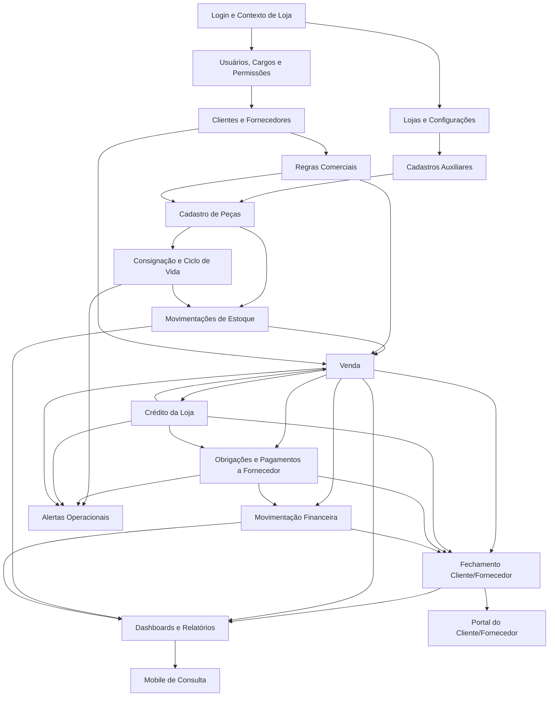

---
tags:
  - renova
  - funcoes
  - relacionamentos
  - arquitetura
status: proposta
origem:
  - "[[Requisitos por Modulos]]"
  - "[[Modelagem Banco de Dados Renova]]"
last_update: 2026-03-16
---

# Relações entre as Funções do App

Documento de referência funcional para mostrar como as principais funções do Renova se relacionam entre si, quais validações dependem umas das outras e quais estruturas de dados são impactadas em cada fluxo.

## Premissas Gerais de Relação

Estas relações aparecem em quase todas as funções operacionais do sistema:

- Autenticar o usuário em `usuario` e registrar acesso em `usuario_acesso_evento`.
- Resolver a loja ativa do contexto e validar vínculo em `usuario_loja`.
- Validar cargos e permissões via `usuario_loja_cargo`, `cargo`, `cargo_permissao` e `permissao`.
- Garantir segregação por `loja_id` em todos os dados operacionais.
- Registrar trilha de auditoria em `auditoria_evento` para alterações críticas.
- Refletir os efeitos colaterais da função em estoque, financeiro, crédito, fechamento e alertas quando aplicável.

## Mapa Macro das Relações

## Relações Transversais

### Função: Login e escolha de loja

Relações:
- Validar credenciais em `usuario`.
- Registrar sucesso ou falha em `usuario_acesso_evento`.
- Carregar lojas acessíveis em `usuario_loja`.
- Carregar cargos do contexto em `usuario_loja_cargo`.
- Expandir permissões por meio de `cargo`, `cargo_permissao` e `permissao`.
- Definir a loja ativa que servirá de filtro para todas as demais funções.

### Função: Auditoria de ação crítica

Relações:
- Depende de usuário autenticado e loja ativa.
- Recebe a entidade alterada e o tipo de ação executada.
- Persiste o antes/depois em `auditoria_evento`.
- É acionada por cadastros, vendas, cancelamentos, pagamentos, ajustes e fechamentos.

## Funções por Módulo

### Função: Cadastrar usuário

Relações:
- Exige permissão administrativa da loja.
- Valida unicidade de e-mail em `usuario`.
- Pode vincular o usuário a uma `pessoa` existente.
- Pode preparar o vínculo com uma ou mais lojas via `usuario_loja`.
- Pode preparar cargos por loja via `usuario_loja_cargo`.
- Deve registrar a criação em `auditoria_evento`.

### Função: Alterar status de usuário

Relações:
- Exige permissão para gestão de acesso.
- Atualiza `usuario.status_usuario`.
- Impacta autenticação futura e o uso do portal.
- Deve manter histórico em `auditoria_evento`.

### Função: Criar cargo e atribuir permissões

Relações:
- Depende da loja ativa.
- Grava o cargo em `cargo`.
- Relaciona funções do sistema em `cargo_permissao`.
- Afeta imediatamente o acesso das funções operacionais para usuários vinculados ao cargo.
- Deve registrar a alteração em `auditoria_evento`.

### Função: Vincular usuário a loja

Relações:
- Grava vínculo em `usuario_loja`.
- Pode marcar usuário como responsável da loja.
- Pode vincular um ou mais cargos em `usuario_loja_cargo`.
- Passa a habilitar acesso a estoque, vendas, financeiro e fechamento da loja vinculada.
- Deve registrar a alteração em `auditoria_evento`.

### Função: Cadastrar loja

Relações:
- Grava dados principais em `loja`.
- Vincula a loja a um `conjunto_catalogo`.
- Prepara configuração operacional em `loja_configuracao`.
- Permite posterior vínculo de usuários, pessoas, regras comerciais, meios de pagamento e peças.
- Deve registrar a criação em `auditoria_evento`.

### Função: Configurar dados operacionais da loja

Relações:
- Atualiza `loja_configuracao`.
- Afeta impressão de etiquetas, recibos e documentos.
- Influencia o comportamento de exibição por loja.
- Deve registrar a alteração em `auditoria_evento`.

### Função: Cadastrar cliente/fornecedor

Relações:
- Grava ou atualiza o cadastro mestre em `pessoa`.
- Pode vincular login de portal via `usuario.pessoa_id`.
- Pode receber dados bancários em `pessoa_conta_bancaria`.
- Não fica operacional na loja até existir o vínculo em `pessoa_loja`.
- Deve registrar a alteração em `auditoria_evento`.

### Função: Vincular cliente/fornecedor a uma loja

Relações:
- Grava o relacionamento em `pessoa_loja`.
- Define se a pessoa atua como cliente, fornecedor ou ambos.
- Define política padrão de fim da consignação.
- Habilita saldo de crédito, fechamento, vendas e obrigações financeiras naquela loja.
- Deve registrar a alteração em `auditoria_evento`.

### Função: Manter dados bancários do fornecedor

Relações:
- Depende de `pessoa` já cadastrada.
- Grava em `pessoa_conta_bancaria`.
- É usada por pagamentos e repasses ao fornecedor.
- Deve registrar a alteração em `auditoria_evento`.

### Função: Manter cadastros auxiliares

Relações:
- Atualiza `produto_nome`, `marca`, `tamanho`, `cor`, `categoria` e `colecao`.
- Todos os registros pertencem a um `conjunto_catalogo`.
- São consumidos diretamente no cadastro de peças.
- Impactam filtros, dashboards e relatórios.
- Devem ser auditados quando houver criação, alteração ou inativação.

### Função: Configurar regra comercial da loja

Relações:
- Grava a regra padrão em `loja_regra_comercial`.
- Define percentuais, prazo de exposição e política de desconto.
- É usada ao cadastrar novas peças e ao calcular vendas e repasses.
- Pode ser sobrescrita por fornecedor ou manualmente por peça.
- Deve registrar a alteração em `auditoria_evento`.

### Função: Configurar regra comercial do fornecedor

Relações:
- Depende de `pessoa_loja` com papel de fornecedor.
- Grava exceção em `fornecedor_regra_comercial`.
- Sobrescreve a regra da loja ao cadastrar peças daquele fornecedor.
- Impacta cálculo de repasse e fim de consignação.
- Deve registrar a alteração em `auditoria_evento`.

### Função: Configurar meios de pagamento

Relações:
- Grava em `meio_pagamento`.
- Define taxas e prazos usados na venda e na conciliação financeira.
- Afeta `venda_pagamento`, `liquidacao_obrigacao_fornecedor` e `movimentacao_financeira`.
- Deve registrar a alteração em `auditoria_evento`.

### Função: Cadastrar peça

Relações:
- Exige usuário autenticado, vínculo com a loja e permissão de cadastro.
- Consome `produto_nome`, `marca`, `tamanho`, `cor`, `categoria`, `colecao`.
- Consome `pessoa` e `pessoa_loja` quando houver fornecedor.
- Grava a peça em `peca`.
- Congela a condição comercial efetiva em `peca_condicao_comercial`.
- Pode registrar fotos em `peca_imagem`.
- Deve gerar entrada inicial em `movimentacao_estoque`.
- Deve registrar a ação em `auditoria_evento`.

### Função: Alterar preço da peça

Relações:
- Depende de `peca` existente e permissão adequada.
- Atualiza `peca.preco_venda_atual`.
- Registra histórico em `peca_historico_preco`.
- Pode impactar dashboards, relatórios e cálculo de venda futura.
- Deve registrar a alteração em `auditoria_evento`.

### Função: Gerenciar ciclo de vida da consignação

Relações:
- Usa `peca` e `peca_condicao_comercial`.
- Calcula prazo de permanência e descontos por tempo de loja.
- Pode gerar saída operacional por devolução, doação, perda ou descarte.
- Aciona `movimentacao_estoque` para refletir a mudança de status.
- Pode gerar comprovantes e alertas.
- Deve registrar a alteração em `auditoria_evento`.

### Função: Registrar ajuste manual de estoque

Relações:
- Exige permissão específica de ajuste.
- Atualiza saldo em `peca.quantidade_atual` ou status da peça.
- Registra evento em `movimentacao_estoque`.
- Pode gerar alerta operacional se o ajuste for crítico.
- Deve registrar a alteração em `auditoria_evento`.

### Função: Consultar estoque

Relações:
- Lê `peca`, `movimentacao_estoque`, `produto_nome`, `marca`, `categoria`, `pessoa` e demais cadastros auxiliares.
- Depende da loja ativa e das permissões do usuário.
- Alimenta telas operacionais, dashboards, relatórios e portal interno.

### Função: Registrar venda

Relações:
- Exige usuário autenticado, loja ativa e permissão de venda.
- Valida disponibilidade das peças em `peca`.
- Lê regras comerciais aplicadas em `peca_condicao_comercial`.
- Lê comprador em `pessoa`, quando informado.
- Lê meios de pagamento ativos em `meio_pagamento`.
- Valida saldo de crédito em `conta_credito_loja`, quando houver uso de crédito.
- Grava cabeçalho em `venda`.
- Grava itens em `venda_item`.
- Grava pagamentos em `venda_pagamento`.
- Atualiza estoque e status da peça em `peca`.
- Registra saída em `movimentacao_estoque`.
- Pode gerar `movimentacao_credito_loja` se houver débito de crédito.
- Pode gerar `obrigacao_fornecedor` conforme tipo da peça.
- Pode gerar `movimentacao_financeira` para recebimento da venda.
- Deve registrar a venda em `auditoria_evento`.

### Função: Cancelar venda

Relações:
- Exige permissão específica de cancelamento.
- Atualiza `venda.status_venda`.
- Reabre saldo e status das peças afetadas.
- Registra estorno em `movimentacao_estoque`.
- Pode exigir estorno em `movimentacao_credito_loja`.
- Pode exigir reversão de `obrigacao_fornecedor`.
- Pode exigir estorno em `movimentacao_financeira`.
- Deve registrar o cancelamento em `auditoria_evento`.
- Pode gerar `alerta_operacional` para revisão.

### Função: Gerar crédito da loja

Relações:
- Depende de `conta_credito_loja`, criando a conta se necessário.
- Pode ser acionada por ajuste manual ou por repasse ao fornecedor.
- Registra o evento em `movimentacao_credito_loja`.
- Afeta uso posterior na venda e o saldo exibido no portal.
- Deve registrar a alteração em `auditoria_evento`.

### Função: Consumir crédito da loja em uma compra

Relações:
- É acionada dentro do fluxo de venda.
- Valida saldo disponível em `conta_credito_loja`.
- Registra débito em `movimentacao_credito_loja`.
- Relaciona a movimentação à `venda` ou ao `venda_pagamento`.
- Impacta fechamento e extrato do cliente/fornecedor.

### Função: Gerar obrigação financeira com fornecedor

Relações:
- Pode ser acionada ao vender peça consignada ou ao registrar peça fixa/lote.
- Lê `venda_item`, `peca`, `peca_condicao_comercial` e `pessoa`.
- Grava a obrigação em `obrigacao_fornecedor`.
- Define status inicial e saldo em aberto.
- Alimenta fechamento, dashboards, relatórios e alertas.
- Deve registrar a criação em `auditoria_evento`.

### Função: Liquidar pagamento ao fornecedor

Relações:
- Depende de `obrigacao_fornecedor` pendente ou parcial.
- Pode usar `meio_pagamento` financeiro, `conta_credito_loja` ou combinação.
- Grava a liquidação em `liquidacao_obrigacao_fornecedor`.
- Atualiza saldo aberto e status de `obrigacao_fornecedor`.
- Pode gerar crédito em `movimentacao_credito_loja`.
- Pode gerar saída em `movimentacao_financeira`.
- Deve registrar a operação em `auditoria_evento`.

### Função: Registrar despesa, ajuste ou movimentação financeira avulsa

Relações:
- Exige permissão financeira.
- Grava em `movimentacao_financeira`.
- Pode usar `meio_pagamento`.
- Afeta resumo financeiro, dashboards e relatórios.
- Deve registrar a operação em `auditoria_evento`.

### Função: Conciliar financeiro

Relações:
- Consolida `venda_pagamento`, `liquidacao_obrigacao_fornecedor` e `movimentacao_financeira`.
- Usa `meio_pagamento` para agrupar totais e taxas.
- Serve de base para conferência diária, relatórios e dashboards financeiros.
- Pode gerar `alerta_operacional` em caso de inconsistência.

### Função: Gerar fechamento de cliente/fornecedor

Relações:
- Exige loja ativa e permissão de fechamento.
- Consolida dados de `peca`, `venda`, `venda_item`, `obrigacao_fornecedor`, `liquidacao_obrigacao_fornecedor`, `movimentacao_credito_loja` e `movimentacao_financeira`.
- Grava o cabeçalho em `fechamento_pessoa`.
- Grava snapshot de peças em `fechamento_pessoa_item`.
- Grava snapshot financeiro em `fechamento_pessoa_movimento`.
- Produz base para resumo de WhatsApp, PDF e Excel.
- Deve registrar a geração em `auditoria_evento`.

### Função: Conferir ou liquidar fechamento

Relações:
- Atualiza `fechamento_pessoa.status_fechamento`.
- Pode depender da quitação de pendências em `obrigacao_fornecedor`.
- Pode depender de acerto de crédito em `movimentacao_credito_loja`.
- Pode depender de ajustes em `movimentacao_financeira`.
- Deve registrar a alteração em `auditoria_evento`.

### Função: Consultar dashboards

Relações:
- Não cria dados próprios no MVP.
- Lê `venda`, `venda_item`, `peca`, `movimentacao_financeira`, `obrigacao_fornecedor`, `movimentacao_estoque` e cadastros auxiliares.
- Depende da loja ativa e dos filtros do usuário.
- Pode ser consumida por frontend web e mobile.

### Função: Emitir relatórios

Relações:
- Lê as mesmas bases transacionais dos dashboards.
- Pode aplicar filtros por loja, período, fornecedor, categoria, marca, status e tipo de peça.
- Pode reutilizar dados de `fechamento_pessoa` para relatórios financeiros consolidados.
- Não exige tabelas próprias no banco no primeiro corte.

### Função: Imprimir documentos

Relações:
- Consome `loja_configuracao` para cabeçalho e identificação.
- Consome `peca` e `peca_imagem` para etiqueta.
- Consome `venda` e `venda_pagamento` para recibo.
- Consome `liquidacao_obrigacao_fornecedor` para comprovante de pagamento.
- Consome operações de devolução ou doação para comprovantes específicos.

### Função: Portal do cliente/fornecedor

Relações:
- Depende de `usuario` vinculado à `pessoa`.
- Filtra o acesso pelas lojas vinculadas em `pessoa_loja`.
- Exibe peças atuais via `peca`.
- Exibe peças vendidas e valores via `venda` e `venda_item`.
- Exibe saldo e extrato via `conta_credito_loja` e `movimentacao_credito_loja`.
- Exibe pagamentos e pendências via `obrigacao_fornecedor` e `liquidacao_obrigacao_fornecedor`.
- Exibe fechamento histórico via `fechamento_pessoa`.

### Função: Mobile de consulta

Relações:
- Reutiliza autenticação, contexto de loja e permissões do backend.
- Consome consultas de dashboards, peças, vendas, saldos, pendências e fechamentos.
- Não cria registros transacionais nesta versão.

### Função: Geração de alertas operacionais

Relações:
- Lê `peca_condicao_comercial` e `peca` para alertar consignação próxima do fim.
- Lê `obrigacao_fornecedor` para alertar pagamentos pendentes.
- Lê `conta_credito_loja` e `movimentacao_credito_loja` para alertar inconsistência de crédito.
- Lê `venda` e `movimentacao_financeira` para alertar cancelamentos e ajustes relevantes.
- Grava alertas em `alerta_operacional`.

## Dependências por Tipo de Função

### Funções que dependem diretamente de autenticação e cargo

- Cadastro de usuário
- Gestão de cargos e permissões
- Cadastro de loja
- Cadastro de pessoa
- Manutenção de cadastros auxiliares
- Configuração comercial
- Cadastro e ajuste de peça
- Venda e cancelamento
- Crédito da loja
- Pagamento a fornecedor
- Movimentação financeira
- Fechamento

### Funções que disparam estoque

- Cadastro de peça
- Ajuste manual de estoque
- Venda
- Cancelamento de venda
- Devolução, doação, perda e descarte

### Funções que disparam financeiro

- Venda
- Pagamento a fornecedor
- Crédito manual ou por repasse
- Uso de crédito na compra
- Despesas e ajustes financeiros
- Fechamento

### Funções que alimentam dashboards, relatórios, portal e mobile

- Cadastro de peça
- Movimentações de estoque
- Vendas
- Crédito da loja
- Pagamentos e repasses
- Movimentações financeiras
- Fechamentos
- Alertas

## Observação Final

Este documento descreve relação funcional e dependência entre casos de uso. Ele deve ser usado como base para:

- desenhar endpoints e permissões
- organizar handlers e serviços de domínio
- definir transações que precisam ser atômicas
- identificar efeitos colaterais obrigatórios de cada operação
